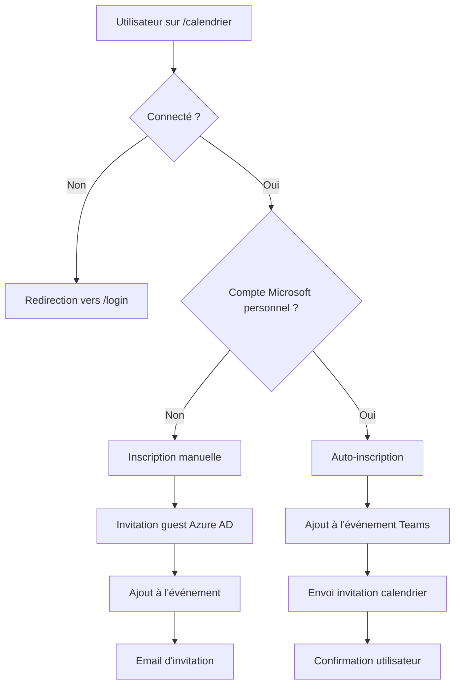

# 🚀 Guide d'Auto-inscription pour les Utilisateurs Microsoft Personnels

## 🎯 Fonctionnalité Implémentée

L'application détecte maintenant automatiquement les utilisateurs avec des comptes Microsoft personnels (Outlook, Hotmail, etc.) et leur propose une inscription automatique aux événements Teams.

## 🔄 Flux d'Inscription

### **Pour les Utilisateurs Microsoft Personnels** (ex: `damien_balet@outlook.com`)

1. **Connexion** : L'utilisateur se connecte via Microsoft Entra ID
2. **Détection** : L'application détecte automatiquement le domaine Microsoft personnel
3. **Auto-inscription** : Clic sur "S'inscrire automatiquement" → Ajout direct à l'événement Teams
4. **Invitation** : L'utilisateur reçoit une invitation Teams dans son calendrier Microsoft

### **Pour les Autres Utilisateurs**

1. **Inscription manuelle** : Clic sur "Demander l'accès"
2. **Saisie** : Email et nom requis
3. **Invitation** : Envoi d'une invitation guest via Azure AD
4. **Ajout** : Ajout à l'événement Teams

## 🛠️ Composants Modifiés

### **1. Détection des Comptes Microsoft** (`src/lib/microsoft.ts`)
```typescript
export function isPersonalMicrosoftAccount(email: string): boolean {
  const personalMicrosoftDomains = [
    'outlook.com', 'hotmail.com', 'live.com', 'msn.com', 'passport.com'
  ]
  const domain = email.toLowerCase().split('@')[1]
  return personalMicrosoftDomains.includes(domain)
}
```

### **2. Auto-inscription** (`src/lib/microsoft.ts`)
```typescript
export async function autoRegisterMicrosoftUser(
  eventId: string,
  userEmail: string,
  userName: string,
  accessToken: string
): Promise<{ success: boolean; message: string; meetingUrl?: string }>
```

### **3. API Route** (`src/app/api/webinars/[id]/auto-register/route.ts`)
- Vérifie l'authentification
- Détecte les comptes Microsoft personnels
- Effectue l'auto-inscription
- Envoie l'invitation Teams

### **4. Interface Utilisateur** (`src/app/(site)/calendrier/CalendrierClient.tsx`)
- Bouton adaptatif selon le type d'utilisateur
- Messages personnalisés
- Gestion des deux flux d'inscription

## 🧪 Test de la Fonctionnalité

### **Prérequis**
1. Compte Microsoft personnel (Outlook, Hotmail, etc.)
2. Application déployée avec les bonnes variables d'environnement
3. Événements Teams créés dans le calendrier

### **Étapes de Test**

1. **Connexion avec un compte Microsoft personnel**
   ```
   damien_balet@outlook.com
   ```

2. **Accès à la page calendrier**
   ```
   https://helvetiforma.ch/calendrier
   ```

3. **Vérification de l'interface**
   - Le bouton doit afficher "S'inscrire automatiquement"
   - Le sous-texte doit indiquer "Ajout direct au calendrier"

4. **Test d'inscription**
   - Cliquer sur le bouton d'inscription
   - Vérifier le message de succès
   - Vérifier l'ajout à l'événement Teams

5. **Vérification de l'invitation**
   - Vérifier l'email reçu
   - Vérifier l'ajout dans le calendrier Microsoft
   - Vérifier l'accès à l'événement Teams

## 🔧 Configuration Requise

### **Variables d'Environnement**
```env
MICROSOFT_CLIENT_ID=your-client-id
MICROSOFT_CLIENT_SECRET=your-client-secret
MICROSOFT_TENANT_ID=your-tenant-id
MICROSOFT_CALENDAR_USER=damien@helvetiforma.onmicrosoft.com
```

### **Permissions Azure AD**
- `User.Read` - Lecture des informations utilisateur
- `Calendars.ReadWrite` - Lecture/écriture du calendrier
- `OnlineMeetings.ReadWrite` - Gestion des réunions Teams
- `User.Invite.All` - Invitation d'utilisateurs guest

## 🎨 Interface Utilisateur

### **Utilisateur Microsoft Personnel Connecté**
```
┌─────────────────────────────────────┐
│  [S'inscrire automatiquement]      │
│  Ajout direct au calendrier        │
└─────────────────────────────────────┘
```

### **Utilisateur Non-Microsoft ou Non Connecté**
```
┌─────────────────────────────────────┐
│  [Demander l'accès]                │
│  Invitation par email              │
└─────────────────────────────────────┘
```

## 🚨 Gestion des Erreurs

### **Erreurs Possibles**
1. **Utilisateur non authentifié** → Redirection vers login
2. **Compte non-Microsoft** → Message d'erreur explicite
3. **Événement non trouvé** → Message d'erreur
4. **Déjà inscrit** → Message de confirmation
5. **Erreur API** → Message d'erreur générique

### **Messages Utilisateur**
- ✅ "Inscription automatique réussie ! Vous recevrez une invitation Teams."
- ❌ "Cette fonctionnalité est réservée aux comptes Microsoft personnels"
- ❌ "Événement non trouvé"
- ℹ️ "Vous êtes déjà inscrit à cet événement"

## 🔄 Flux Complet



## 📊 Avantages

### **Pour les Utilisateurs Microsoft Personnels**
- ✅ Inscription en un clic
- ✅ Ajout automatique au calendrier
- ✅ Invitation Teams directe
- ✅ Expérience fluide

### **Pour l'Administration**
- ✅ Réduction des étapes manuelles
- ✅ Meilleure conversion
- ✅ Gestion automatique des invitations
- ✅ Traçabilité des inscriptions

---

**Note** : Cette fonctionnalité améliore significativement l'expérience utilisateur pour les détenteurs de comptes Microsoft personnels tout en conservant la compatibilité avec tous les autres types d'utilisateurs.
