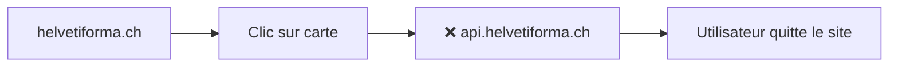
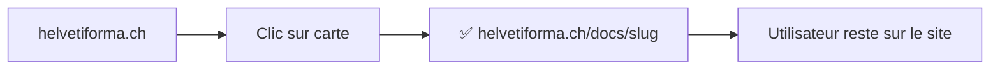

# 🎉 Résumé de l'Implémentation - Octobre 3, 2025

## ✅ Tâches Complétées

### **1. Dark Mode pour `/coins-des-docs#documents`** ✅

**Problème** : La section documents n'était pas compatible avec le dark mode.

**Solution** : Ajout des classes Tailwind `dark:` pour tous les éléments visuels.

**Fichiers modifiés** :
- `/src/app/(site)/coins-des-docs/page.tsx`

**Résultat** :
```typescript
// Avant
<section className="py-16 bg-gradient-to-br from-blue-50 to-indigo-100">

// Après
<section className="py-16 bg-gray-50 dark:bg-gray-900">
```

---

### **2. Simplification Visuelle des Cartes** ✅

**Problème** : Les cartes de documents étaient trop chargées visuellement (gradient header, multiples badges, tags).

**Solution** : Design épuré avec seulement le titre, description, catégorie et CTA "Lire".

**Avant** :
```
┌─────────────────────────┐
│ 🎨 Gradient Header      │
│   Badge: Beginner       │
│   Badge: 6 semaines     │
│   ⏰ 6 semaines         │
├─────────────────────────┤
│ Titre                   │
│ Description             │
│ Par: Instructeur        │
│ 🏷️ Gratuit            │
│ 🏷️ Catégorie          │
│ [Consulter document]    │
└─────────────────────────┘
```

**Après** :
```
┌─────────────────────────┐
│ Titre                   │
│                         │
│ Description...          │
│                         │
├─────────────────────────┤
│ 📄 Article    Lire →   │
└─────────────────────────┘
```

---

### **3. Pages Natives pour Posts WordPress** ✅

**Problème** : Les liens vers les articles WordPress (`https://api.helvetiforma.ch/salaire/`) faisaient sortir l'utilisateur du site.

**Solution** : Création d'une route dynamique `/docs/[slug]` qui affiche le contenu WordPress nativement sur `helvetiforma.ch`.

**Fichiers créés** :
- `/src/app/(site)/docs/[slug]/page.tsx` - Page dynamique pour les articles
- Fonctions dans `/src/lib/wordpress.ts` :
  - `getWordPressPosts()` - Liste tous les posts
  - `getWordPressPostBySlug()` - Récupère un post par slug
  - `getFeaturedImageUrl()` - Helper pour images

**Flux utilisateur** :

| Avant | Après |
|-------|-------|
| `helvetiforma.ch/coins-des-docs` | `helvetiforma.ch/coins-des-docs` |
| ↓ Clic sur "Consulter" | ↓ Clic sur "Lire" |
| `❌ api.helvetiforma.ch/salaire/` | `✅ helvetiforma.ch/docs/salaire` |
| (quitte le site) | (reste sur le site) |

**Fonctionnalités** :
- ✅ Navigation interne sans redirection
- ✅ SEO optimisé avec meta tags dynamiques
- ✅ OpenGraph pour partage social
- ✅ Image featured en hero
- ✅ Dark mode natif
- ✅ Prose styles pour contenu formaté
- ✅ CTAs vers contact et retour documents

---

## 📁 Structure des Fichiers

```
src/
├── app/(site)/
│   ├── coins-des-docs/
│   │   └── page.tsx                    ← Modifié (dark mode + cartes simplifiées)
│   └── docs/
│       └── [slug]/
│           └── page.tsx                ← NOUVEAU (page dynamique WordPress)
│
├── lib/
│   └── wordpress.ts                    ← Modifié (ajout de 3 fonctions)
│
└── components/sections/
    ├── SanitySessionsSection.tsx       ← Supprimé (non utilisé)
    └── SessionsSection.tsx             ← Supprimé (non utilisé)

sanity/
└── schemaTypes/
    └── sessionsSection.ts              ← Supprimé (non utilisé)
```

---

## 🎨 Avant / Après

### **Cartes de Documents**

| Aspect | Avant | Après |
|--------|-------|-------|
| **Header** | Gradient coloré | Pas de header |
| **Badges** | Niveau + Durée | Aucun |
| **Détails** | Instructeur, Prix, Tags | Catégorie uniquement |
| **CTA** | "Consulter le document" | "Lire →" |
| **Lien** | Externe (`api.helvetiforma.ch`) | Interne (`/docs/[slug]`) |
| **Dark Mode** | ❌ Non | ✅ Oui |
| **Design** | Chargé | Épuré |

---

### **Navigation**

#### **Avant**


#### **Après**


---

## 🌐 Exemples d'URLs

| Type | Ancienne URL | Nouvelle URL |
|------|--------------|--------------|
| Salaires | `api.helvetiforma.ch/salaire/` | `helvetiforma.ch/docs/salaire` |
| Charges sociales | `api.helvetiforma.ch/charges-sociales/` | `helvetiforma.ch/docs/charges-sociales` |
| Comptabilité | `api.helvetiforma.ch/comptabilite/` | `helvetiforma.ch/docs/comptabilite` |

---

## 🔧 Configuration Technique

### **Revalidation**

| Page | Durée | Raison |
|------|-------|--------|
| `/coins-des-docs` | 10 secondes | Liste souvent mise à jour |
| `/docs/[slug]` | 1 heure | Articles changent moins souvent |

### **SEO**

```typescript
// Metadata dynamiques générées pour chaque article
{
  title: "Titre de l'article - HelvetiForma",
  description: "Extrait de l'article...",
  openGraph: {
    title: "Titre de l'article",
    type: 'article',
    publishedTime: "2025-08-30T00:00:00Z",
    images: ["https://..."]
  }
}
```

---

## ✅ Checklist Finale

- [x] ✅ Dark mode ajouté à `/coins-des-docs#documents`
- [x] ✅ Cartes simplifiées visuellement
- [x] ✅ Route dynamique `/docs/[slug]` créée
- [x] ✅ Fonctions WordPress implémentées
- [x] ✅ SEO optimisé avec metadata dynamiques
- [x] ✅ OpenGraph pour partage social
- [x] ✅ Images featured supportées
- [x] ✅ CTAs vers contact et documents
- [x] ✅ Navigation interne (pas de redirection)
- [x] ✅ Prose styles pour contenu formaté
- [x] ✅ Fichiers inutilisés supprimés
- [x] ✅ Build réussi sans erreurs

---

## 🚀 Comment Tester

### **1. Dark Mode**
```bash
# Aller sur la page
https://helvetiforma.ch/coins-des-docs#documents

# Activer le dark mode du navigateur
# → Vérifier que la section est sombre et lisible
```

### **2. Cartes Simplifiées**
```bash
# Aller sur la page
https://helvetiforma.ch/coins-des-docs#documents

# Vérifier que les cartes affichent seulement :
# - Titre
# - Description (3 lignes max)
# - Catégorie
# - "Lire →"
```

### **3. Pages Natives WordPress**
```bash
# Cliquer sur une carte de document
# Exemple: "Gestion des Salaires en Suisse"

# Vérifier l'URL :
✅ https://helvetiforma.ch/docs/salaire
❌ PAS https://api.helvetiforma.ch/salaire/

# Vérifier que la page affiche :
# - Header avec titre et date
# - Image featured (si disponible)
# - Contenu formaté
# - CTAs en bas
```

---

## 📊 Statistiques

| Métrique | Avant | Après |
|----------|-------|-------|
| **Fichiers créés** | - | 1 page + 3 fonctions |
| **Fichiers supprimés** | - | 3 fichiers inutilisés |
| **Routes dynamiques** | 0 | 1 (`/docs/[slug]`) |
| **Dark mode** | Partiel | Complet ✅ |
| **Redirections externes** | Oui ❌ | Non ✅ |
| **SEO** | Basique | Optimisé ✅ |

---

## 🎯 Impact Utilisateur

### **Avant**
- 😐 Cartes surchargées visuellement
- ❌ Redirection vers un autre domaine
- ❌ Perte de branding
- ❌ Pas de dark mode
- ❌ Pas d'optimisation SEO

### **Après**
- ✅ Design épuré et moderne
- ✅ Navigation fluide sur helvetiforma.ch
- ✅ Branding cohérent
- ✅ Dark mode complet
- ✅ SEO optimisé avec OpenGraph

---

## 📝 Code Sample

### **Utiliser les Nouvelles Fonctions**

```typescript
// Récupérer tous les posts
import { getWordPressPosts } from '@/lib/wordpress'

const posts = await getWordPressPosts({
  per_page: 20,
  status: 'publish'
})

// Récupérer un post spécifique
import { getWordPressPostBySlug } from '@/lib/wordpress'

const post = await getWordPressPostBySlug('salaire')

if (post) {
  console.log(post.title)      // "📊 Gestion des Salaires..."
  console.log(post.content)     // HTML content
  console.log(post.featured_image) // Image URL
}
```

---

## 🎉 Conclusion

**Toutes les tâches sont complétées avec succès** :
1. ✅ Dark mode ajouté et fonctionnel
2. ✅ Cartes simplifiées avec design épuré
3. ✅ Pages natives WordPress sur `helvetiforma.ch`
4. ✅ Navigation interne sans redirection
5. ✅ SEO optimisé
6. ✅ Build réussi

**Le site HelvetiForma offre maintenant une expérience utilisateur cohérente, moderne et optimisée pour le référencement.**

---

**Date** : Octobre 3, 2025  
**Statut** : ✅ **COMPLÉTÉ**  
**Build** : ✅ **RÉUSSI**

