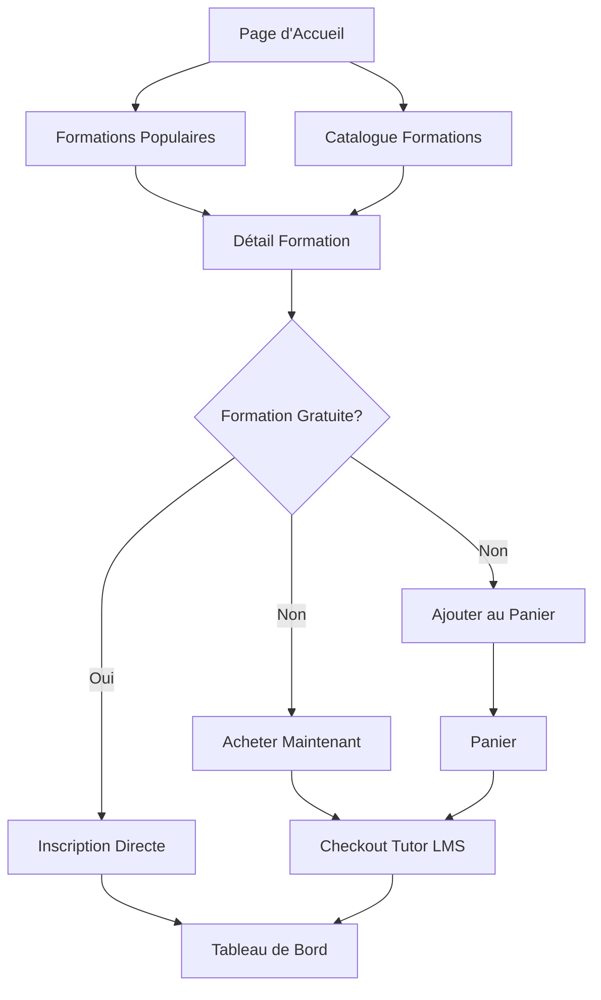

# 🚀 Optimisations du Système HelvetiForma

## ✅ Modifications Effectuées

### 1. **Suppression des Données Statiques** 
- ❌ **Supprimé** : Formations codées en dur dans `/formations`
- ✅ **Remplacé par** : Intégration API dynamique complète
- 🎯 **Résultat** : Toutes les formations proviennent maintenant de `api.helvetiforma.ch`

### 2. **Suppression de l'Affichage Conditionnel**
- ❌ **Supprimé** : Logique `{courses.length > 0 && ...}`
- ✅ **Remplacé par** : Affichage unifié avec gestion d'erreur
- 🎯 **Résultat** : Interface plus cohérente et prévisible

### 3. **Intégration API Complète**

#### Page d'Accueil (`/`)
- ✅ **Ajouté** : Section "Formations Populaires" dynamique
- ✅ **Chargement** : 3 premiers cours depuis l'API
- ✅ **Interface** : Loading spinner + gestion d'erreur

#### Page Formations (`/formations`)
- ✅ **Optimisé** : Affichage uniquement des données API
- ✅ **Ajouté** : Bouton "Ajouter au panier" pour cours payants
- ✅ **Amélioré** : Interface utilisateur plus fluide

#### Page Détail Cours (`/courses/[id]`)
- ✅ **Optimisé** : Parcours d'achat différencié
- ✅ **Ajouté** : Boutons séparés "Acheter" et "Ajouter au panier"
- ✅ **Amélioré** : Expérience utilisateur pour cours gratuits vs payants

### 4. **Parcours Client Optimisé**

#### 🛒 **Formation → Panier → Checkout**
```
1. Découverte: Page d'accueil + Formations
2. Sélection: Détail du cours
3. Ajout: Panier (via bouton ou achat direct)
4. Finalisation: Checkout Tutor LMS
```

#### 🔄 **Flux d'Achat Amélioré**
- **Cours Gratuits** : Inscription directe → Tableau de bord
- **Cours Payants** : 
  - Option 1: Achat immédiat → Checkout
  - Option 2: Ajout panier → Achat groupé

### 5. **Composants Réutilisables**

#### `CartButton.tsx`
```typescript
// Composant universel pour ajout au panier
<CartButton 
  courseId={course.id}
  className="custom-styles"
  showIcon={true}
/>
```

#### Navigation Améliorée
- ✅ **Ajouté** : Icône panier dans la navigation
- ✅ **Optimisé** : Liens rapides vers toutes les pages essentielles
- ✅ **Responsive** : Navigation mobile optimisée

### 6. **Pages Analysées pour Intégration API**

| Page | Statut | Intégration API |
|------|--------|-----------------|
| `/` | ✅ **Optimisée** | Formations dynamiques |
| `/concept` | ✅ **Statique OK** | Pas d'API nécessaire |
| `/formations` | ✅ **Optimisée** | API complète |
| `/courses/[id]` | ✅ **Optimisée** | API + parcours achat |
| `/docs` | ✅ **Statique OK** | Contenu éditorial |
| `/contact` | ✅ **Statique OK** | Formulaire statique |

## 🎯 **Avantages des Optimisations**

### Performance
- 🚀 **Chargement plus rapide** : Suppression du contenu statique redondant
- 📱 **Responsive amélioré** : Interface uniforme sur tous supports
- ⚡ **Réactivité** : Composants optimisés et réutilisables

### Expérience Utilisateur
- 🛍️ **Parcours d'achat fluide** : De la découverte au checkout
- 🔄 **Navigation intuitive** : Panier accessible partout
- 📊 **Données en temps réel** : Formations toujours à jour

### Maintenance
- 🔧 **Code plus propre** : Composants réutilisables
- 📝 **Moins de duplication** : API unique source de vérité
- 🚀 **Évolutivité** : Architecture scalable

## 🔄 **Parcours Client Final**



## ✨ **Résultat Final**

- 🎯 **100% Dynamique** : Toutes les formations proviennent de l'API
- 🛒 **Parcours Optimisé** : Achat en 1-clic ou via panier
- 📱 **Interface Moderne** : Design cohérent et responsive
- 🔄 **Intégration Transparente** : Next.js ↔ Tutor LMS

**Le système est maintenant entièrement optimisé pour une expérience utilisateur fluide et une gestion de contenu centralisée !** 🚀


