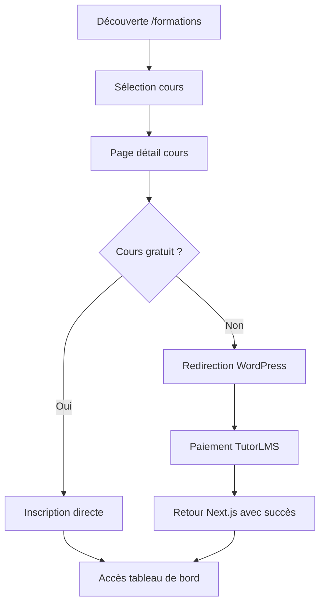
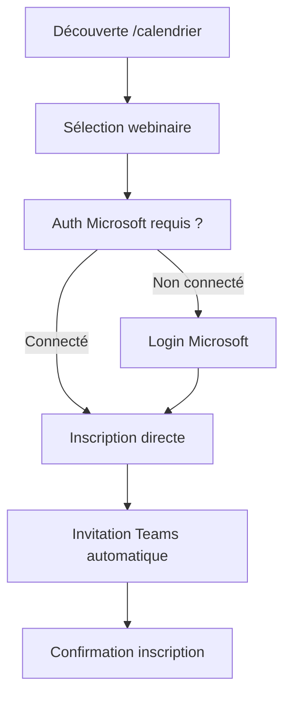
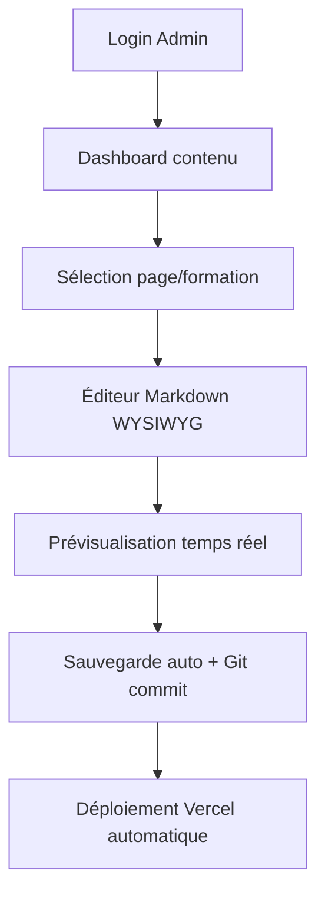

# HelvetiForma v3 - Brief de Développement Optimisé

## 🎯 Vision du Projet

**HelvetiForma v3** est une plateforme d'apprentissage hybride moderne, conçue pour offrir la meilleure expérience utilisateur tout en simplifiant drastiquement la gestion de contenu pour la cliente. Cette version combine les leçons apprises des versions précédentes avec une approche révolutionnaire pour la gestion de contenu.

---

## 🚀 Innovation Majeure : Gestion de Contenu Simplifiée

### Problème Identifié
Les projets précédents utilisaient des systèmes complexes :
- **v1** : Système custom Supabase + interface admin complexe
- **v2** : ACF WordPress + API headless (complexité technique élevée)

### Solution v3 : Fichiers Markdown + Interface Admin Intuitive
```
📁 content/
├── pages/
│   ├── home.md              # Page d'accueil
│   ├── concept.md           # Page concept  
│   ├── formations.md        # Page formations
│   └── contact.md           # Page contact
├── formations/
│   ├── charges-sociales.md
│   ├── impot-source.md
│   └── salaires.md
└── config/
    ├── navigation.md        # Configuration navigation
    ├── seo.md              # Paramètres SEO globaux
    └── contact-info.md     # Informations de contact
```

**Avantages :**
- ✅ **Simplicité** : Fichiers Markdown = édition intuitive
- ✅ **Versionning** : Git = historique complet des modifications
- ✅ **Performance** : Pas de base de données = chargement instantané
- ✅ **Backup automatique** : Chaque modification = commit Git
- ✅ **Collaboration** : Plusieurs personnes peuvent éditer
- ✅ **Portabilité** : Contenu indépendant de la technologie

---

## 🏗️ Stack Technique Optimisée

### Frontend
- **Next.js 15.5.4** + **React 19.1.0** + **TypeScript**
- **Tailwind CSS v4** (configuration inline moderne)
- **Framer Motion** pour les animations
- **next-mdx-remote** pour le rendu Markdown avancé

### Backend & Services
- **TutorLMS** (WordPress) : Cours payants + authentification
- **Microsoft Graph API** : Webinaires Teams gratuits
- **Supabase** : Données utilisateur minimales + analytics
- **Stripe** : Paiements (fallback si TutorLMS insuffisant)

### Déploiement
- **Vercel** : Frontend Next.js
- **WordPress** : `cms.helvetiforma.ch` (TutorLMS)
- **Domaine principal** : `app.helvetiforma.ch`

---

## 📁 Architecture de Fichiers

```
helvetiforma_v3/
├── content/                     # 🎯 CONTENU ÉDITABLE
│   ├── pages/
│   ├── formations/
│   └── config/
├── src/
│   ├── app/                     # Pages Next.js App Router
│   │   ├── (public)/           # Pages publiques
│   │   │   ├── page.tsx        # Accueil
│   │   │   ├── concept/
│   │   │   ├── formations/
│   │   │   └── contact/
│   │   ├── (courses)/          # Cours TutorLMS  
│   │   │   ├── courses/
│   │   │   └── tableau-de-bord/
│   │   ├── (webinars)/         # Webinaires Teams
│   │   │   └── calendrier/
│   │   ├── (auth)/             # Authentification
│   │   │   ├── login-wordpress/
│   │   │   └── login-microsoft/
│   │   ├── admin/              # Interface admin contenu
│   │   └── api/                # APIs internes
│   ├── components/
│   │   ├── ui/                 # Composants de base
│   │   ├── layout/             # Layout et navigation
│   │   ├── content/            # Rendu contenu Markdown
│   │   ├── forms/              # Formulaires
│   │   └── integrations/       # Intégrations externes
│   ├── lib/
│   │   ├── content.ts          # Gestion contenu Markdown
│   │   ├── wordpress.ts        # API WordPress/TutorLMS
│   │   ├── microsoft.ts        # API Microsoft Graph
│   │   └── supabase.ts         # Supabase minimal
│   ├── types/                  # Types TypeScript
│   └── utils/                  # Utilitaires
├── public/                     # Assets statiques
└── docs/                       # Documentation
```

---

## 🎨 Interface Admin Révolutionnaire

### Concept : "Notion-like" pour Markdown
```typescript
interface ContentEditor {
  // Éditeur WYSIWYG pour Markdown
  editor: 'rich-text' | 'markdown' | 'split-view';
  
  // Prévisualisation en temps réel
  preview: 'live' | 'side-by-side';
  
  // Sauvegarde automatique
  autosave: boolean;
  
  // Gestion des médias
  media: {
    upload: 'drag-drop' | 'file-picker';
    storage: 'public/images' | 'external-cdn';
  };
}
```

### Fonctionnalités Admin
- 📝 **Éditeur Markdown WYSIWYG** (style Notion/Obsidian)
- 🖼️ **Upload d'images** par drag & drop
- 👀 **Prévisualisation temps réel** de la page
- 💾 **Sauvegarde automatique** + Git commits
- 🔄 **Historique des versions** avec rollback
- 📱 **Interface responsive** pour édition mobile
- 🎨 **Thèmes d'éditeur** (clair/sombre)

---

## 🔧 Configuration Tailwind CSS v4

```javascript
// tailwind.config.js
export default {
  content: ['./src/**/*.{js,ts,jsx,tsx,mdx}'],
  theme: {
    extend: {
      colors: {
        primary: {
          50: '#eff6ff',
          500: '#3b82f6',
          900: '#1e3a8a',
        },
        helvetiforma: {
          blue: '#2563eb',
          green: '#059669',
          purple: '#7c3aed',
          orange: '#ea580c',
        }
      },
      fontFamily: {
        sans: ['Inter', 'system-ui', 'sans-serif'],
        mono: ['JetBrains Mono', 'monospace'],
      },
      animation: {
        'fade-in': 'fadeIn 0.5s ease-in-out',
        'slide-up': 'slideUp 0.3s ease-out',
      }
    },
  },
  plugins: [
    require('@tailwindcss/typography'),
    require('@tailwindcss/forms'),
  ],
}
```

```css
/* src/app/globals.css */
@import "tailwindcss";

@theme inline {
  --color-primary-50: #eff6ff;
  --color-primary-500: #3b82f6;
  --color-primary-900: #1e3a8a;
  
  --font-sans: Inter, system-ui, sans-serif;
  --font-mono: 'JetBrains Mono', monospace;
}

:root {
  --background: #ffffff;
  --foreground: #0f172a;
}

@media (prefers-color-scheme: dark) {
  :root {
    --background: #0f172a;
    --foreground: #f8fafc;
  }
}

body {
  background: var(--background);
  color: var(--foreground);
  font-family: var(--font-sans);
}
```

---

## 🔗 Intégrations & APIs

### 1. TutorLMS (WordPress)
```typescript
interface TutorLMSIntegration {
  // Authentification
  auth: {
    method: 'JWT' | 'Application-Password';
    endpoint: '/wp-json/tutor/v1/auth';
  };
  
  // Cours
  courses: {
    list: '/wp-json/tutor/v1/courses';
    detail: '/wp-json/tutor/v1/courses/{id}';
    enroll: '/wp-json/tutor/v1/enroll';
    purchase: '/wp-json/tutor/v1/purchase';
  };
  
  // Paiements natifs TutorLMS
  payments: 'native-tutor-lms'; // Pas de Stripe côté Next.js
}
```

### 2. Microsoft Graph (Teams)
```typescript
interface MicrosoftIntegration {
  // Auth avec NextAuth.js
  auth: {
    provider: 'microsoft';
    scopes: ['User.Read', 'Calendars.ReadWrite', 'OnlineMeetings.ReadWrite'];
  };
  
  // Webinaires
  webinars: {
    list: '/graph/v1.0/me/events';
    create: '/graph/v1.0/me/events';
    register: 'custom-registration-flow';
  };
}
```

### 3. Supabase (Minimal)
```sql
-- Tables essentielles uniquement
CREATE TABLE app_users (
  id UUID PRIMARY KEY,
  email TEXT UNIQUE,
  first_name TEXT,
  last_name TEXT,
  created_at TIMESTAMP DEFAULT NOW()
);

CREATE TABLE identity_links (
  id UUID PRIMARY KEY,
  app_user_id UUID REFERENCES app_users(id),
  provider TEXT, -- 'wordpress' | 'microsoft'
  provider_user_id TEXT,
  email TEXT,
  created_at TIMESTAMP DEFAULT NOW()
);

CREATE TABLE webinar_registrations (
  id UUID PRIMARY KEY,
  app_user_id UUID REFERENCES app_users(id),
  microsoft_event_id TEXT,
  registered_at TIMESTAMP DEFAULT NOW()
);
```

---

## 📄 Système de Contenu Markdown

### Structure des Fichiers Markdown
```markdown
---
title: "Accueil - HelvetiForma"
description: "Formation professionnelle en comptabilité suisse"
seo:
  title: "HelvetiForma - Formation Comptabilité Suisse"
  description: "Formations certifiées en comptabilité suisse..."
  keywords: ["formation", "comptabilité", "suisse"]
hero:
  title: "Maîtrisez la Comptabilité Suisse"
  subtitle: "Formations certifiées par des experts"
  cta_text: "Découvrir nos formations"
  cta_link: "/formations"
  background_image: "/images/hero-bg.jpg"
sections:
  - type: "features"
    title: "Pourquoi HelvetiForma ?"
    items:
      - title: "Expertise Suisse"
        description: "Formateurs certifiés en comptabilité suisse"
        icon: "🇨🇭"
      - title: "Flexibilité"
        description: "Cours en ligne et webinaires interactifs"
        icon: "⏰"
---

# Contenu de la page

Votre contenu Markdown ici...
```

### API de Contenu
```typescript
// lib/content.ts
interface ContentAPI {
  // Lecture
  getPage(slug: string): Promise<PageContent>;
  getFormation(slug: string): Promise<FormationContent>;
  getNavigation(): Promise<NavigationConfig>;
  
  // Écriture (admin uniquement)
  updatePage(slug: string, content: PageContent): Promise<void>;
  uploadImage(file: File): Promise<string>;
  
  // Git intégration
  commitChanges(message: string): Promise<void>;
  getHistory(file: string): Promise<GitCommit[]>;
}
```

---

## 🎯 Flux Utilisateurs Optimisés

### 1. Parcours Cours Payants (TutorLMS)


### 2. Parcours Webinaires Gratuits (Teams)


### 3. Gestion de Contenu (Admin)


---

## 🔐 Authentification Duale

### Stratégie d'Authentification
```typescript
interface AuthStrategy {
  // Contexte TutorLMS (cours payants)
  wordpress: {
    method: 'redirect-to-wordpress';
    pages: ['/courses', '/tableau-de-bord', '/panier'];
    fallback: 'oauth2-wp'; // Phase 2 optionnelle
  };
  
  // Contexte Microsoft (webinaires gratuits)
  microsoft: {
    method: 'nextauth-microsoft';
    pages: ['/calendrier'];
    session: 'server-side';
  };
  
  // Admin (gestion contenu)
  admin: {
    method: 'simple-credentials'; // Ou OAuth selon besoins
    access: ['/admin'];
  };
}
```

### Variables d'Environnement
```bash
# WordPress/TutorLMS
NEXT_PUBLIC_WORDPRESS_URL=https://cms.helvetiforma.ch
WORDPRESS_APP_USER=service-account
WORDPRESS_APP_PASSWORD=xxxx-xxxx-xxxx-xxxx
TUTOR_LICENSE_KEY=xxxx

# Microsoft Graph
MICROSOFT_CLIENT_ID=your-client-id
MICROSOFT_CLIENT_SECRET=your-client-secret
MICROSOFT_TENANT_ID=your-tenant-id

# Supabase (minimal)
SUPABASE_URL=your-supabase-url
SUPABASE_ANON_KEY=your-anon-key
SUPABASE_SERVICE_ROLE_KEY=your-service-key

# Content Management
GITHUB_TOKEN=xxxx # Pour commits automatiques (optionnel)
ADMIN_PASSWORD=secure-admin-password

# Deployment
VERCEL_TOKEN=xxxx
REVALIDATE_SECRET=xxxx
```

---

## 📊 Performance & SEO

### Optimisations Next.js 15
```typescript
// next.config.ts
const nextConfig = {
  // App Router optimisé
  experimental: {
    typedRoutes: true,
    serverActions: true,
  },
  
  // Images optimisées
  images: {
    domains: ['cms.helvetiforma.ch'],
    formats: ['image/webp', 'image/avif'],
  },
  
  // ISR pour contenu Markdown
  async rewrites() {
    return [
      {
        source: '/content/:path*',
        destination: '/api/content/:path*',
      },
    ];
  },
};
```

### Stratégie de Cache
- **Contenu Markdown** : ISR avec revalidation on-demand
- **API TutorLMS** : Cache court (5min) avec SWR
- **API Microsoft** : Cache session + refresh tokens
- **Images** : CDN Vercel + optimisation automatique

---

## 🧪 Tests & Qualité

### Stack de Tests
```json
{
  "testing": {
    "unit": "Jest + Testing Library",
    "e2e": "Playwright",
    "visual": "Chromatic (optionnel)",
    "performance": "Lighthouse CI"
  },
  "quality": {
    "linting": "ESLint + Prettier",
    "types": "TypeScript strict mode",
    "commits": "Conventional Commits",
    "ci": "GitHub Actions"
  }
}
```

---

## 🚀 Plan de Développement

### Phase 1 : Foundation (Semaine 1-2)
- [x] Setup Next.js 15 + TypeScript + Tailwind v4
- [ ] Architecture de dossiers
- [ ] Système de contenu Markdown
- [ ] Interface admin de base
- [ ] Pages statiques (accueil, concept, contact)

### Phase 2 : Intégrations (Semaine 3-4)
- [ ] TutorLMS API + authentification
- [ ] Microsoft Graph + NextAuth
- [ ] Supabase setup minimal
- [ ] Pages dynamiques (/formations, /calendrier)

### Phase 3 : UX/UI (Semaine 5-6)
- [ ] Design system complet
- [ ] Animations Framer Motion
- [ ] Interface admin avancée
- [ ] Tests utilisateurs

### Phase 4 : Production (Semaine 7-8)
- [ ] Tests automatisés
- [ ] Optimisations performance
- [ ] Déploiement Vercel
- [ ] Documentation utilisateur

---

## 💡 Innovations Clés de la v3

### 1. **Gestion de Contenu Révolutionnaire**
- Markdown + Git = Simplicité + Robustesse
- Interface admin "Notion-like"
- Versionning automatique

### 2. **Architecture Hybride Optimale**
- Next.js pour l'UX moderne
- TutorLMS pour la robustesse e-learning
- Microsoft Teams pour l'interactivité

### 3. **Performance Maximale**
- Tailwind v4 inline
- ISR intelligent
- Bundle size optimisé

### 4. **Maintenance Minimale**
- Moins de dépendances
- Code plus simple
- Documentation intégrée

---

## ❓ Questions Ouvertes

1. **Contenu existant** : Souhaitez-vous migrer le contenu des versions précédentes ?
2. **Design** : Faut-il conserver l'identité visuelle actuelle ou la moderniser ?
3. **Fonctionnalités** : Y a-t-il des fonctionnalités spécifiques des v1/v2 à préserver ?
4. **Timeline** : Quel est le délai souhaité pour la mise en production ?

---

## 🎯 Validation du Brief

**Ce brief vous convient-il ?** 

✅ **Avantages de cette approche :**
- Simplicité de gestion pour la cliente
- Performance optimale
- Maintenance réduite
- Évolutivité maximale

⚠️ **Points à valider :**
- Acceptation du système Markdown
- Validation de l'architecture technique
- Confirmation des intégrations requises

**Une fois ce brief validé, nous pourrons commencer le développement immédiatement avec une roadmap claire et des objectifs précis.**

## Payload CMS Setup

This project uses Payload CMS with Supabase (Postgres) and Vercel Blob for media.

Required envs:
```
DATABASE_URL=postgresql://... (with sslmode=require)
PAYLOAD_SECRET=change-me
PAYLOAD_API_URL=https://your-payload-cloud.app
BLOB_READ_WRITE_TOKEN=vercel-blob-token
```

# Frontend connected to Payload CMS
