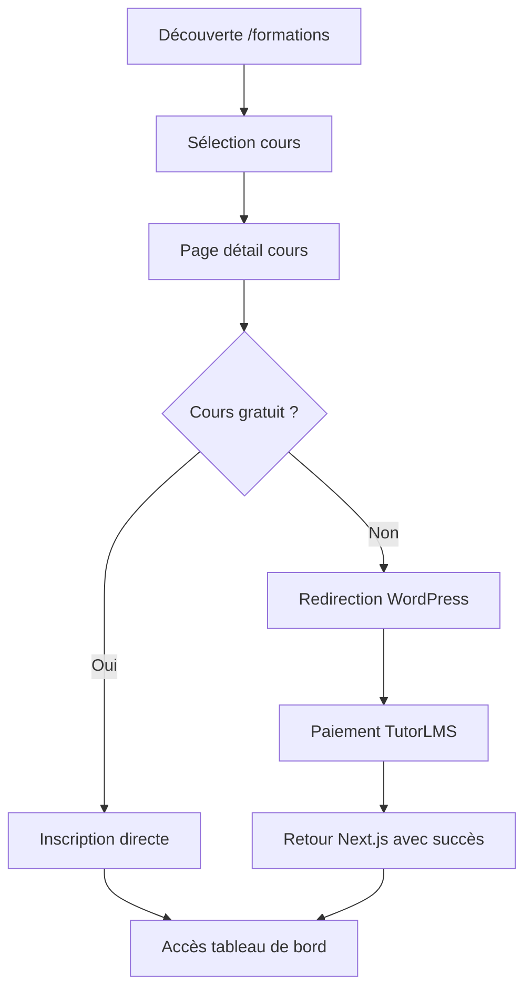
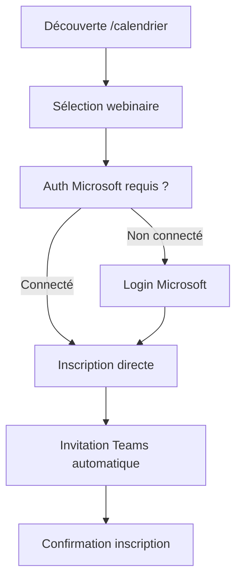
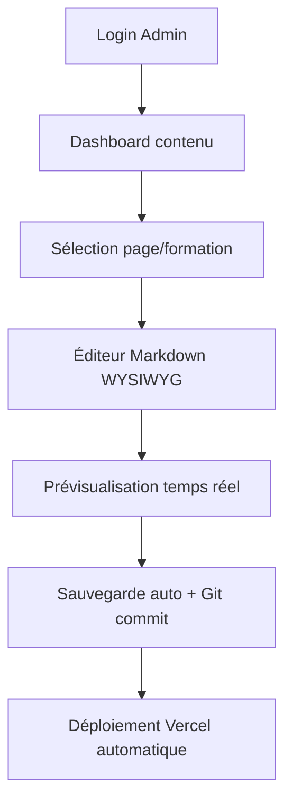

# HelvetiForma v3 - Modern Learning Platform

## 🎯 Vision du Projet

**HelvetiForma v3** est une plateforme d'apprentissage hybride moderne, conçue pour offrir la meilleure expérience utilisateur avec une gestion de contenu professionnelle et intuitive. Cette version combine les leçons apprises des versions précédentes avec **Sanity CMS**, une solution mature et éprouvée par des milliers de sites en production.

---

## 🚀 Innovation Majeure : Sanity CMS

### Évolution des Versions
- **v1** : Système custom Supabase + interface admin complexe → Trop complexe
- **v2** : ACF WordPress + API headless → Lourd et difficile à maintenir
- **Payload CMS** : Nouveau, instable, erreurs de cache, problèmes React 19
- **v3 (Sanity)** : Solution mature, performante, et éprouvée ✨

### Pourquoi Sanity ?
```
📁 sanity/
├── sanity.config.ts         # Configuration Sanity
├── schemaTypes/
│   ├── index.ts
│   └── page.ts             # Schema pour pages flexibles
└── package.json            # Sanity dependencies
```

**Avantages Sanity :**
- ✅ **Mature & Stable** : Utilisé par des milliers de sites en production
- ✅ **Pas de BDD à gérer** : Sanity héberge tout sur son infrastructure
- ✅ **Collaboration temps réel** : Plusieurs éditeurs simultanés
- ✅ **Éditeur intuitif** : Rich text avec Portable Text (headings, lists, images, links)
- ✅ **Performance** : CDN global Sanity pour contenu ultra-rapide
- ✅ **Images optimisées** : Transformation d'images à la volée
- ✅ **TypeScript natif** : Types générés automatiquement
- ✅ **Free tier généreux** : Parfait pour vos besoins
- ✅ **Support professionnel** : Documentation excellente, communauté active

---

## 🏗️ Stack Technique Optimisée

### Frontend
- **Next.js 15.5.4** + **React 19.1.0** + **TypeScript**
- **Tailwind CSS v4** (configuration inline moderne)
- **Framer Motion** pour les animations
- **Sanity CMS** avec `next-sanity` et `@portabletext/react`
- **Portable Text** pour rich text rendering

### Backend & Services
- **Sanity CMS** : Gestion de contenu headless
- **TutorLMS** (WordPress) : Cours payants + authentification
- **Microsoft Graph API** : Webinaires Teams gratuits
- **Supabase** : Données utilisateur minimales + analytics

### Déploiement
- **Vercel** : Frontend Next.js
- **Sanity Cloud** : CMS hosting (Sanity Studio peut aussi être hébergé sur Sanity)
- **WordPress** : `cms.helvetiforma.ch` (TutorLMS)
- **Domaine principal** : `app.helvetiforma.ch`

---

## 📁 Architecture de Fichiers

```
helvetiforma_v3/
├── sanity/                      # 🎯 SANITY CMS STUDIO
│   ├── sanity.config.ts
│   ├── schemaTypes/
│   │   ├── index.ts
│   │   └── page.ts
│   └── package.json
├── src/
│   ├── app/                     # Pages Next.js App Router
│   │   ├── (public)/           # Pages publiques
│   │   │   ├── page.tsx        # Accueil
│   │   │   ├── concept/
│   │   │   ├── formations/
│   │   │   └── contact/
│   │   ├── (courses)/          # Cours TutorLMS  
│   │   │   ├── courses/
│   │   │   └── tableau-de-bord/
│   │   ├── (webinars)/         # Webinaires Teams
│   │   │   └── calendrier/
│   │   ├── (auth)/             # Authentification
│   │   │   ├── login-wordpress/
│   │   │   └── login-microsoft/
│   │   ├── admin/              # Interface admin contenu
│   │   └── api/                # APIs internes
│   ├── components/
│   │   ├── ui/                 # Composants de base
│   │   ├── layout/             # Layout et navigation
│   │   ├── content/            # Rendu contenu Markdown
│   │   ├── forms/              # Formulaires
│   │   └── integrations/       # Intégrations externes
│   ├── lib/
│   │   ├── sanity.ts           # Sanity client et GROQ queries
│   │   ├── wordpress.ts        # API WordPress/TutorLMS
│   │   ├── microsoft.ts        # API Microsoft Graph
│   │   └── supabase.ts         # Supabase minimal
│   ├── types/                  # Types TypeScript
│   └── utils/                  # Utilitaires
├── public/                     # Assets statiques
└── docs/                       # Documentation
```

---

## 🎨 Sanity Studio - Interface Admin Professionnelle

### Concept : CMS Headless Moderne
```typescript
interface SanityPage {
  _id: string
  title: string
  slug: { current: string }
  description?: string
  hero?: {
    title?: string
    subtitle?: string
    backgroundImage?: any
    ctaPrimary?: { text?: string; link?: string }
  }
  sections?: Array<{
    _key: string
    title?: string
    subtitle?: string
    content?: PortableTextBlock[]  // Rich text
    columns?: number  // 1, 2, or 3 column layouts
  }>
}
```

### Fonctionnalités Sanity Studio
- 📝 **Rich Text Editor** avec Portable Text (headings, lists, links, images, blockquotes)
- 🖼️ **Gestion des médias** intégrée avec transformations d'images
- 👀 **Prévisualisation en temps réel** (built-in feature)
- 💾 **Autosave** automatique
- 🔄 **Historique des versions** avec rollback (built-in)
- 👥 **Collaboration temps réel** multi-utilisateurs
- 📱 **Interface responsive** pour édition mobile
- 🎨 **Thèmes** clair/sombre
- 🌐 **Accessible de n'importe où** (cloud-hosted)

---

## 🔧 Configuration Tailwind CSS v4

```javascript
// tailwind.config.js
export default {
  content: ['./src/**/*.{js,ts,jsx,tsx,mdx}'],
  theme: {
    extend: {
      colors: {
        primary: {
          50: '#eff6ff',
          500: '#3b82f6',
          900: '#1e3a8a',
        },
        helvetiforma: {
          blue: '#2563eb',
          green: '#059669',
          purple: '#7c3aed',
          orange: '#ea580c',
        }
      },
      fontFamily: {
        sans: ['Inter', 'system-ui', 'sans-serif'],
        mono: ['JetBrains Mono', 'monospace'],
      },
      animation: {
        'fade-in': 'fadeIn 0.5s ease-in-out',
        'slide-up': 'slideUp 0.3s ease-out',
      }
    },
  },
  plugins: [
    require('@tailwindcss/typography'),
    require('@tailwindcss/forms'),
  ],
}
```

```css
/* src/app/globals.css */
@import "tailwindcss";

@theme inline {
  --color-primary-50: #eff6ff;
  --color-primary-500: #3b82f6;
  --color-primary-900: #1e3a8a;
  
  --font-sans: Inter, system-ui, sans-serif;
  --font-mono: 'JetBrains Mono', monospace;
}

:root {
  --background: #ffffff;
  --foreground: #0f172a;
}

@media (prefers-color-scheme: dark) {
  :root {
    --background: #0f172a;
    --foreground: #f8fafc;
  }
}

body {
  background: var(--background);
  color: var(--foreground);
  font-family: var(--font-sans);
}
```

---

## 🔗 Intégrations & APIs

### 1. TutorLMS (WordPress)
```typescript
interface TutorLMSIntegration {
  // Authentification
  auth: {
    method: 'JWT' | 'Application-Password';
    endpoint: '/wp-json/tutor/v1/auth';
  };
  
  // Cours
  courses: {
    list: '/wp-json/tutor/v1/courses';
    detail: '/wp-json/tutor/v1/courses/{id}';
    enroll: '/wp-json/tutor/v1/enroll';
    purchase: '/wp-json/tutor/v1/purchase';
  };
  
  // Paiements natifs TutorLMS
  payments: 'native-tutor-lms'; // Pas de Stripe côté Next.js
}
```

### 2. Microsoft Graph (Teams)
```typescript
interface MicrosoftIntegration {
  // Auth avec NextAuth.js
  auth: {
    provider: 'microsoft';
    scopes: ['User.Read', 'Calendars.ReadWrite', 'OnlineMeetings.ReadWrite'];
  };
  
  // Webinaires
  webinars: {
    list: '/graph/v1.0/me/events';
    create: '/graph/v1.0/me/events';
    register: 'custom-registration-flow';
  };
}
```

### 3. Supabase (Minimal)
```sql
-- Tables essentielles uniquement
CREATE TABLE app_users (
  id UUID PRIMARY KEY,
  email TEXT UNIQUE,
  first_name TEXT,
  last_name TEXT,
  created_at TIMESTAMP DEFAULT NOW()
);

CREATE TABLE identity_links (
  id UUID PRIMARY KEY,
  app_user_id UUID REFERENCES app_users(id),
  provider TEXT, -- 'wordpress' | 'microsoft'
  provider_user_id TEXT,
  email TEXT,
  created_at TIMESTAMP DEFAULT NOW()
);

CREATE TABLE webinar_registrations (
  id UUID PRIMARY KEY,
  app_user_id UUID REFERENCES app_users(id),
  microsoft_event_id TEXT,
  registered_at TIMESTAMP DEFAULT NOW()
);
```

---

## 📄 Système de Contenu Sanity

### Structure de Contenu dans Sanity Studio
Les pages sont éditées visuellement dans Sanity Studio avec:
- **Title** : Titre de la page
- **Slug** : URL slug (auto-généré)
- **Description** : Description SEO
- **Hero** : Section hero avec titre, sous-titre, image de fond, CTA
- **Sections** : Sections flexibles avec:
  - Titre et sous-titre
  - Rich text content (Portable Text)
  - Choix de colonnes (1, 2, ou 3)

### API Sanity
```typescript
// lib/sanity.ts
import { createClient } from 'next-sanity'

export const sanityClient = createClient({
  projectId: process.env.NEXT_PUBLIC_SANITY_PROJECT_ID,
  dataset: process.env.NEXT_PUBLIC_SANITY_DATASET,
  apiVersion: '2024-01-01',
  useCdn: true,
})

// Fetch page by slug with GROQ
export async function getPageBySlug(slug: string): Promise<SanityPage | null> {
  const query = `*[_type == "page" && slug.current == $slug][0]{
    _id,
    title,
    slug,
    description,
    hero {
      title,
      subtitle,
      backgroundImage,
      ctaPrimary { text, link }
    },
    sections[] {
      _key,
      title,
      subtitle,
      content,
      columns
    }
  }`
  
  return await sanityClient.fetch(query, { slug })
}
```

### Portable Text Rendering
```typescript
// components/ui/PortableText.tsx
import { PortableText as PortableTextReact } from '@portabletext/react'

export default function PortableText({ content }: { content: PortableTextBlock[] }) {
  return <PortableTextReact value={content} components={components} />
}
```

---

## 🎯 Flux Utilisateurs Optimisés

### 1. Parcours Cours Payants (TutorLMS)


### 2. Parcours Webinaires Gratuits (Teams)


### 3. Gestion de Contenu (Admin)


---

## 🔐 Authentification Duale

### Stratégie d'Authentification
```typescript
interface AuthStrategy {
  // Contexte TutorLMS (cours payants)
  wordpress: {
    method: 'redirect-to-wordpress';
    pages: ['/courses', '/tableau-de-bord', '/panier'];
    fallback: 'oauth2-wp'; // Phase 2 optionnelle
  };
  
  // Contexte Microsoft (webinaires gratuits)
  microsoft: {
    method: 'nextauth-microsoft';
    pages: ['/calendrier'];
    session: 'server-side';
  };
  
  // Admin (gestion contenu)
  admin: {
    method: 'simple-credentials'; // Ou OAuth selon besoins
    access: ['/admin'];
  };
}
```

### Variables d'Environnement
```bash
# Sanity CMS
NEXT_PUBLIC_SANITY_PROJECT_ID=xzzyyelh
NEXT_PUBLIC_SANITY_DATASET=production
SANITY_API_TOKEN=your-sanity-token # Optionnel, pour write access

# WordPress/TutorLMS
NEXT_PUBLIC_WORDPRESS_URL=https://cms.helvetiforma.ch
WORDPRESS_APP_USER=service-account
WORDPRESS_APP_PASSWORD=xxxx-xxxx-xxxx-xxxx
TUTOR_LICENSE_KEY=xxxx

# Microsoft Graph
MICROSOFT_CLIENT_ID=your-client-id
MICROSOFT_CLIENT_SECRET=your-client-secret
MICROSOFT_TENANT_ID=your-tenant-id

# Supabase (minimal)
SUPABASE_URL=your-supabase-url
SUPABASE_ANON_KEY=your-anon-key
SUPABASE_SERVICE_ROLE_KEY=your-service-key

# Deployment
VERCEL_TOKEN=xxxx
REVALIDATE_SECRET=xxxx
```

---

## 📊 Performance & SEO

### Optimisations Next.js 15
```typescript
// next.config.ts
const nextConfig = {
  // App Router optimisé
  experimental: {
    typedRoutes: true,
    serverActions: true,
  },
  
  // Images optimisées
  images: {
    domains: ['cms.helvetiforma.ch'],
    formats: ['image/webp', 'image/avif'],
  },
  
  // ISR pour contenu Markdown
  async rewrites() {
    return [
      {
        source: '/content/:path*',
        destination: '/api/content/:path*',
      },
    ];
  },
};
```

### Stratégie de Cache
- **Contenu Markdown** : ISR avec revalidation on-demand
- **API TutorLMS** : Cache court (5min) avec SWR
- **API Microsoft** : Cache session + refresh tokens
- **Images** : CDN Vercel + optimisation automatique

---

## 🧪 Tests & Qualité

### Stack de Tests
```json
{
  "testing": {
    "unit": "Jest + Testing Library",
    "e2e": "Playwright",
    "visual": "Chromatic (optionnel)",
    "performance": "Lighthouse CI"
  },
  "quality": {
    "linting": "ESLint + Prettier",
    "types": "TypeScript strict mode",
    "commits": "Conventional Commits",
    "ci": "GitHub Actions"
  }
}
```

---

## 🚀 Plan de Développement

### Phase 1 : Foundation (Complété ✅)
- [x] Setup Next.js 15 + TypeScript + Tailwind v4
- [x] Architecture de dossiers
- [x] Sanity CMS intégration complète
- [x] Sanity Studio configuré
- [x] Pages dynamiques (accueil, concept, contact)

### Phase 2 : Intégrations (Semaine 3-4)
- [ ] TutorLMS API + authentification
- [ ] Microsoft Graph + NextAuth
- [ ] Supabase setup minimal
- [ ] Pages dynamiques (/formations, /calendrier)

### Phase 3 : UX/UI (Semaine 5-6)
- [ ] Design system complet
- [ ] Animations Framer Motion
- [ ] Interface admin avancée
- [ ] Tests utilisateurs

### Phase 4 : Production (Semaine 7-8)
- [ ] Tests automatisés
- [ ] Optimisations performance
- [ ] Déploiement Vercel
- [ ] Documentation utilisateur

---

## 💡 Innovations Clés de la v3

### 1. **Sanity CMS - Solution Mature**
- Plateforme éprouvée par des milliers de sites
- Interface intuitive avec Portable Text
- Collaboration temps réel multi-utilisateurs
- CDN global pour performance maximale
- Zéro infrastructure à gérer

### 2. **Architecture Hybride Optimale**
- Next.js 15 pour l'UX moderne
- Sanity pour la gestion de contenu
- TutorLMS pour la robustesse e-learning
- Microsoft Teams pour l'interactivité

### 3. **Performance Maximale**
- Tailwind v4 inline
- Sanity CDN global
- Images optimisées automatiquement
- ISR intelligent

### 4. **Maintenance Minimale**
- CMS hébergé par Sanity
- Code plus simple
- Support professionnel Sanity
- Documentation excellente

---

## ❓ Questions Ouvertes

1. **Contenu existant** : Souhaitez-vous migrer le contenu des versions précédentes ?
2. **Design** : Faut-il conserver l'identité visuelle actuelle ou la moderniser ?
3. **Fonctionnalités** : Y a-t-il des fonctionnalités spécifiques des v1/v2 à préserver ?
4. **Timeline** : Quel est le délai souhaité pour la mise en production ?

---

## 🎯 Validation du Brief

**Ce brief vous convient-il ?** 

✅ **Avantages de cette approche :**
- Simplicité de gestion pour la cliente
- Performance optimale
- Maintenance réduite
- Évolutivité maximale

⚠️ **Points à valider :**
- Acceptation du système Markdown
- Validation de l'architecture technique
- Confirmation des intégrations requises

**Une fois ce brief validé, nous pourrons commencer le développement immédiatement avec une roadmap claire et des objectifs précis.**

## 🚀 Getting Started with Sanity

### 1. Start the Frontend
```bash
npm run dev
```
Visit http://localhost:3000

### 2. Start Sanity Studio
```bash
cd sanity
npm run dev
```
Visit http://localhost:3333

### 3. Configure CORS (First Time)
```bash
cd sanity
npx sanity login
npx sanity cors add https://helvetiforma-v3.vercel.app --credentials
npx sanity cors add http://localhost:3000 --credentials
```

### 4. Create Content
1. Access Sanity Studio at http://localhost:3333
2. Log in with Google or GitHub
3. Create a page with slug `home` or `concept`
4. Add hero section and flexible content sections
5. Publish!

### 5. Deploy Sanity Studio (Optional)
```bash
cd sanity
npm run build
npx sanity deploy
```

## 📚 Documentation

- **SANITY_SETUP.md** : Quick start guide
- **SANITY_MIGRATION_COMPLETE.md** : Complete migration documentation
- **sanity/README.md** : Sanity Studio guide
- **DEVELOPMENT_STATUS.md** : Current development status

## 🔗 Useful Links

- **Sanity Studio (Local)**: http://localhost:3333
- **Sanity Management**: https://www.sanity.io/manage
- **Your Sanity Project**: https://www.sanity.io/manage/personal/project/xzzyyelh
- **Sanity Docs**: https://www.sanity.io/docs
- **GROQ Docs**: https://www.sanity.io/docs/groq
