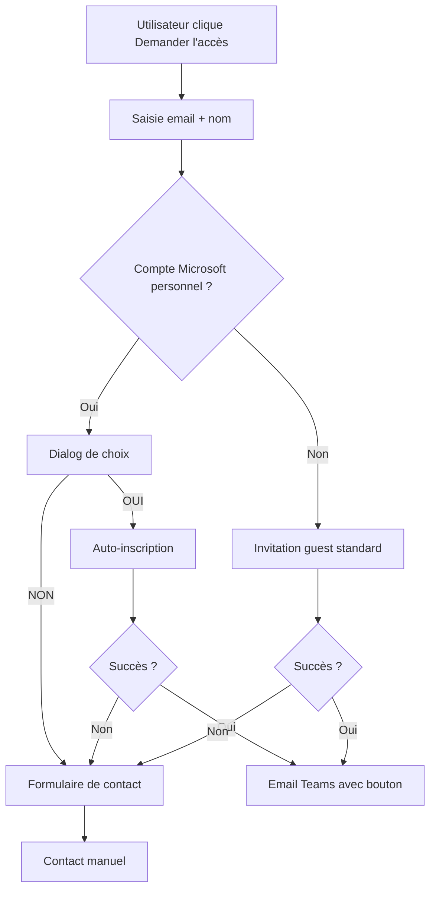

# 🎯 Solution d'Inscription aux Webinaires - Version Finale

## 🚨 Problème Identifié

Les comptes Microsoft personnels (comme `damien_balet@outlook.com`) **ne peuvent pas** se connecter directement à Microsoft Entra ID car c'est réservé aux comptes professionnels/scolaires.

## ✅ Solution Implémentée : Invitation Guest Hybride

### **Flux pour TOUS les Utilisateurs**

1. **Clic sur "Demander l'accès"** → Demande email + nom
2. **Détection automatique** du type de compte
3. **Traitement adaptatif** selon le type d'email

### **Pour les Comptes Microsoft Personnels** (Outlook, Hotmail, etc.)

```
damien_balet@outlook.com
```

**Flux :**
1. **Détection** → "Détection d'un compte Microsoft personnel"
2. **Choix** → Dialog de confirmation :
   - **OUI** = Inscription automatique + invitation Teams
   - **NON** = Formulaire de contact manuel
3. **Auto-inscription** → Invitation guest Azure AD + ajout à l'événement
4. **Résultat** → Email avec bouton "Rejoindre l'événement Teams"

### **Pour les Autres Comptes** (Gmail, Yahoo, etc.)

```
user@gmail.com
```

**Flux :**
1. **Invitation guest** → Invitation Azure AD standard
2. **Ajout à l'événement** → Ajout automatique à l'événement Teams
3. **Résultat** → Email avec bouton "Rejoindre l'événement Teams"

### **Fallback : Formulaire de Contact**

Si l'invitation automatique échoue → Redirection vers `/contact` avec pré-remplissage :
- Nom et email
- Sujet : "Demande d'accès au webinaire: [Titre]"
- Message pré-rempli avec détails du webinaire

## 🛠️ Composants Modifiés

### **1. CalendrierClient.tsx**
- Détection automatique des comptes Microsoft
- Dialog de choix pour les comptes Microsoft
- Fallback vers formulaire de contact
- Gestion des erreurs

### **2. API Auto-register**
- Accepte email/nom en paramètres
- Utilise l'invitation guest standard
- Pas besoin d'authentification utilisateur

### **3. Formulaire de Contact**
- Support des paramètres de webinaire
- Pré-remplissage automatique
- Gestion des cas d'échec

## 🎨 Expérience Utilisateur

### **Compte Microsoft Personnel**
```
┌─────────────────────────────────────────┐
│ Détection d'un compte Microsoft         │
│ personnel (damien_balet@outlook.com).   │
│                                         │
│ Voulez-vous une inscription automatique │
│ avec ajout direct à votre calendrier    │
│ Microsoft ?                             │
│                                         │
│ • OUI = Inscription automatique +       │
│   invitation Teams                      │
│ • NON = Formulaire de contact manuel    │
│                                         │
│ [OUI] [NON]                             │
└─────────────────────────────────────────┘
```

### **Autres Comptes**
```
┌─────────────────────────────────────────┐
│ ✅ Inscription automatique réussie !    │
│                                         │
│ Vous recevrez un email avec le lien     │
│ pour rejoindre le webinaire Teams.      │
│                                         │
│ [OK]                                    │
└─────────────────────────────────────────┘
```

## 🔄 Flux Complet



## 🎯 Avantages de cette Solution

### **✅ Pour les Comptes Microsoft Personnels**
- **Choix utilisateur** : Auto-inscription OU contact manuel
- **Invitation Teams** : Email avec bouton "Rejoindre l'événement"
- **Ajout calendrier** : Événement ajouté automatiquement
- **Expérience fluide** : Pas de complexité d'authentification

### **✅ Pour Tous les Autres Comptes**
- **Invitation standard** : Fonctionne pour tous les emails
- **Ajout automatique** : À l'événement Teams
- **Email Teams** : Avec bouton de rejoindre

### **✅ Fallback Robuste**
- **Formulaire de contact** : Si l'invitation échoue
- **Pré-remplissage** : Avec les détails du webinaire
- **Processus manuel** : Garantit l'inscription

## 🧪 Test avec `damien_balet@outlook.com`

1. **Aller sur** `/calendrier`
2. **Cliquer** "Demander l'accès"
3. **Saisir** : `damien_balet@outlook.com` + nom
4. **Choisir** "OUI" pour l'auto-inscription
5. **Résultat** : Email Teams avec bouton "Rejoindre l'événement"

## 🔧 Configuration Requise

### **Permissions Azure AD**
- `User.Invite.All` - Invitation d'utilisateurs guest
- `Calendars.ReadWrite` - Gestion du calendrier
- `OnlineMeetings.ReadWrite` - Gestion des réunions Teams

### **Variables d'Environnement**
```env
MICROSOFT_CLIENT_ID=your-client-id
MICROSOFT_CLIENT_SECRET=your-client-secret
MICROSOFT_TENANT_ID=your-tenant-id
MICROSOFT_CALENDAR_USER=damien@helvetiforma.onmicrosoft.com
```

## 🎉 Résultat Final

**L'utilisateur `damien_balet@outlook.com` recevra :**

1. **Email d'invitation** avec bouton "Rejoindre l'événement Teams"
2. **Événement ajouté** à son calendrier Microsoft
3. **Accès direct** à la réunion Teams
4. **Expérience professionnelle** et fluide

**Cette solution résout le problème d'authentification tout en offrant une expérience optimale pour tous les types d'utilisateurs !** 🚀
